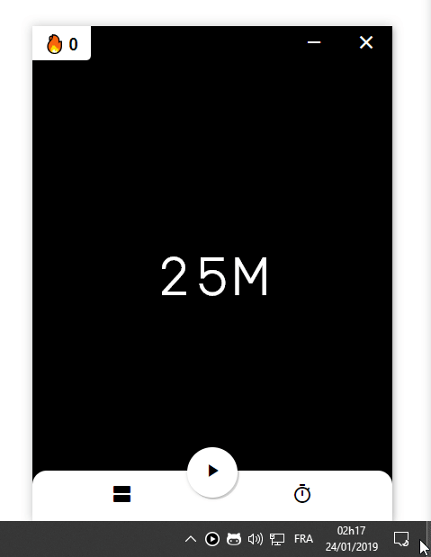

<p align="center">
  
</p>

<h2 align="center">
  Pomodoro
</h2>

<p align="center">
  A simple yet featureful pomodoro in the tray
</p>

<p align="center">
  <a href="https://ci.appveyor.com/project/KeziahMoselle/pomodoro">
    
  </a>
    
  <a href="https://travis-ci.org/KeziahMoselle/pomodoro">
    
  </a>
</p>

<p align="center">
  
  
  
</p>

## [Click to download](https://github.com/KeziahMoselle/pomodoro/releases/latest)

## Features

- Pomodoro (25 minutes of work / 5 minutes of pause)
- Change work time and pause time
- Notifications
- Streak
- Statistics

## Features incoming

- [Inspirational quotes](https://github.com/KeziahMoselle/pomodoro/issues/10)
- [Window focus](https://github.com/KeziahMoselle/pomodoro/issues/11)
- [Feature Discovery](https://github.com/KeziahMoselle/pomodoro/issues/13)

> See [Project v1.0.0](https://github.com/KeziahMoselle/pomodoro/projects/1) for more informations

## Want to contribute ?

### Prerequisites
* Install [NodeJS](https://nodejs.org/en/)
* Use [Yarn](https://yarnpkg.com/) (*Optional*)

### Steps

1. Clone the repository
```sh
> git clone https://github.com/KeziahMoselle/pomodoro.git
```
2. Install dependencies :
```sh
> cd pomodoro && yarn
```
3. Run the app in `development` mode
```sh
> yarn dev
```

### Project tree

```
|-- pomodoro
    |-- assets              <-- Assets for the app
    |-- build               <-- The React build
    |-- dist                <-- Binaries will be generated here
    |-- public
    |   |-- app.js          <-- Electron main process
    |   |-- icons.js
    |   |-- index.html
    |   |-- preload.js      <-- Inject Node modules to the renderer process
    |   |-- store.js        <-- Store
    |   |-- icons
    |-- src                 <-- React App
```

## How to build ?

```sh
> yarn build
```
The binaries will be created in the `dist` folder.

## Built With

* [ElectronJS](https://electronjs.org/) - framework for creating native applications with web technologies
* [ReactJS](https://reactjs.org) - A JavaScript library for building user interfaces


## License

This project is licensed under the [MIT License](LICENSE).
