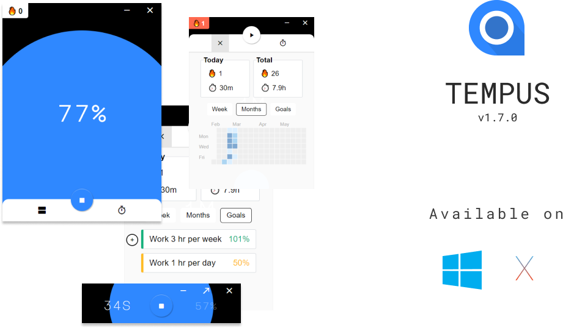
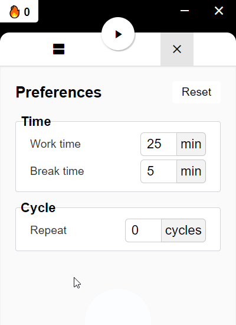
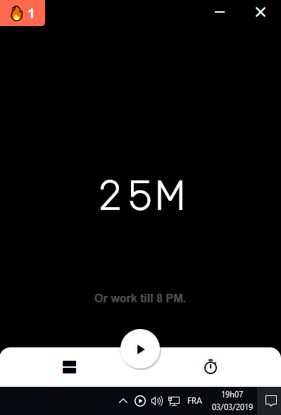
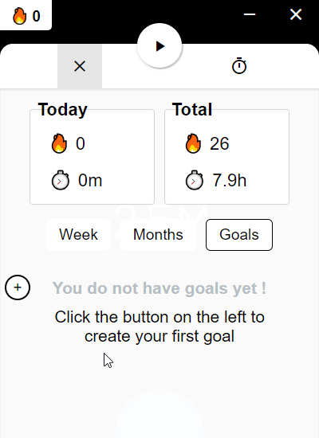
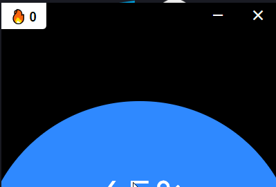
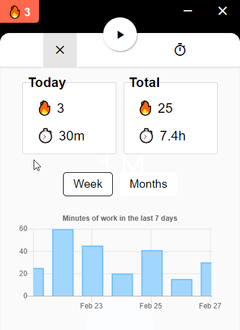
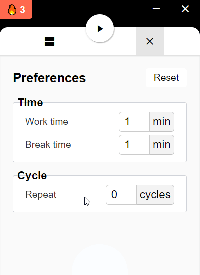

<p align="center">
  
</p>

<h2 align="center">
  Tempus
</h2>

<p align="center">
  A simple yet featureful pomodoro in the tray/menubar
</p>

<p align="center">
  <a href="https://ci.appveyor.com/project/KeziahMoselle/pomodoro">
    
  </a>
    
  <a href="https://travis-ci.org/KeziahMoselle/tempus">
    
  </a>
  
  <a href="https://github.com/KeziahMoselle/tempus/releases/latest">
    
  </a>

  <a href="https://github.com/KeziahMoselle/tempus/commits/master"> 
    
  </a>
  
  <a href="https://github.com/KeziahMoselle/tempus/releases">
    
  </a>
  
</p>

<p align="center">
  
</p>

<h2>
  <a href="https://github.com/KeziahMoselle/pomodoro/releases">Download </a>
</h2>

## Features

Click on the arrows to get more informations about these features

<details>
	<summary>⏱️ Change work time and pause time</summary>

  <p align="center">Want to work 27 min ? You can.</p>
	<p align="center">
    
  </p>
</details>

<details>
	<summary>⏲️ Automagically set the timer till the next hour</summary>

  <p align="center">Want to work until 8 PM ? You can set the timer automagically for you.
  <br><b>Note</b>: It will revert your settings after the timer.
  </p>
	<p align="center">
    
  </p>
</details>

<details>
	<summary>🚩 Goals</summary>

  <p align="center">Want to work at least 1 hour a day ? You can create a goal for that.</p>
	<p align="center">
    
  </p>
</details>

<details>
	<summary>🔥 Streak</summary>

  <p align="center">It counts how many times you finished a pomodoro.</p>
	<p align="center">
    
  </p>
</details>

<details>
	<summary>📊 Statistics</summary>

  <p align="center">It gives you insights about your productivity.</p>
	<p align="center">
    
  </p>
</details>

<details>
	<summary>🔁 Cycles</summary>

  <p align="center">If set, it will automatically stop the pomodoro after `x` times.</p>
	<p align="center">
    
  </p>
</details>

## Want to contribute ?

### Prerequisites
* Have [Node.js](https://nodejs.org/en/)  installed (> 8)

### Steps

1. Clone the repository
```sh
> git clone https://github.com/KeziahMoselle/pomodoro.git
```
2. Install dependencies :
```sh
> cd pomodoro && npm install
```
3. Run the app in `development` mode
```sh
> npm run dev
```

### Project tree

```
|-- pomodoro
    |-- assets              <-- Assets for the app
    |-- build               <-- The React build
    |-- dist                <-- Binaries will be generated here
    |-- public
    |   |-- app.js          <-- Electron main process
    |   |-- icons.js
    |   |-- index.html
    |   |-- preload.js      <-- Inject Node modules to the renderer process
    |   |-- store.js        <-- Store
    |   |-- icons
    |-- src                 <-- React App
        |-- App.jsx         <-- Main component
        |-- index.css       <-- Main CSS
        |-- index.js
        |-- components
        |-- fonts
```

## How to build ?

```sh
> npm run build
```
The binaries will be created in the `dist` folder.

## Built With

* [Electron](https://electronjs.org/) - framework for creating native applications with web technologies
* [React](https://reactjs.org) - A JavaScript library for building user interfaces


## License

This project is licensed under the [MIT License](LICENSE).
